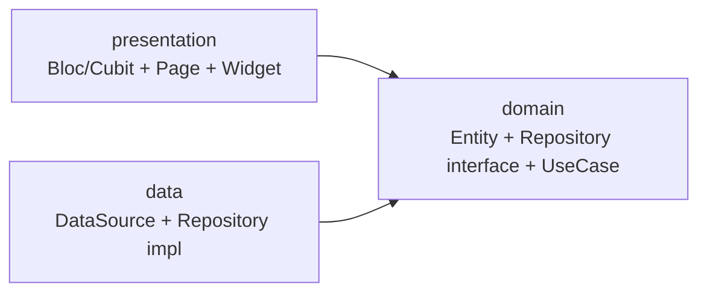
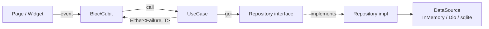
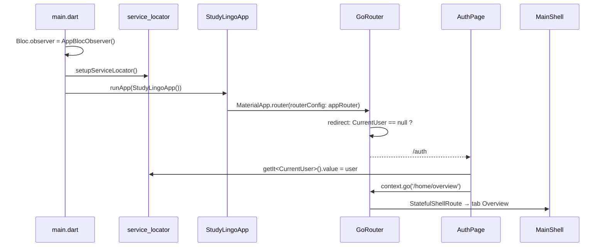

# 01 — Tổng quan kiến trúc

## Mục tiêu

Study Lingo là app học **tiếng Anh** và **tiếng Nhật** dành cho **người dùng nói tiếng Việt**. Hai ngôn ngữ học (EN/JA) là công dân hạng nhất; **tiếng Việt là ngôn ngữ mẹ đẻ** dùng để giải thích, dịch nghĩa, và prompt câu hỏi quiz. Mọi feature (vocabulary, lessons, quiz, audio, writing practice) phải thiết kế để hoạt động cho cả hai target từ đầu, kể cả những đặc thù tiếng Nhật: kanji/kana, furigana, JLPT, thứ tự nét.

> **Quy tắc mẹ đẻ:** khi người học chọn EN hoặc JA làm target, **gloss/giải thích luôn bằng tiếng Việt**, không phải "ngôn ngữ kia trong cặp song ngữ". Chi tiết tại [08 — i18n](./08-localization.md).

Kiến trúc được chọn để đảm bảo:

1. **Có thể thay backend mà không sửa UI** — hôm nay dùng in-memory stub, mai có thể chuyển sang REST/Firebase chỉ bằng cách viết một implementation mới trong `data/` và đổi đăng ký trong `service_locator.dart`.
2. **Test được mọi business logic** — Bloc/Cubit chỉ phụ thuộc use case, mock dễ dàng bằng `mocktail`.
3. **Mở rộng theo feature, không phải theo lớp** — mỗi feature là một lát Clean Architecture độc lập.

## Stack & ràng buộc cứng

| Vai trò | Công nghệ | Ghi chú |
|---|---|---|
| Framework | Flutter 3.41.x / Dart 3.11.x | Stable channel, không dùng fvm |
| State management | `flutter_bloc` + `bloc` | **Bắt buộc.** Không Provider/Riverpod/GetX |
| DI | `get_it` | Tất cả service cross-cutting đăng ký tại đây |
| Routing | `go_router` | Không dùng `Navigator.push(MaterialPageRoute(...))` |
| Error handling | `dartz` (`Either<Failure, T>`) | Trong use case, fold ở bloc |
| HTTP | `dio` (`DioClient` singleton) | Có interceptor log |
| Form validation | `formz` | Dùng khi viết form mới |
| UI | Material 3 (`useMaterial3: true`) | Theme tại `core/theme/app_theme.dart` |
| i18n | `flutter_localizations` + gen-l10n | ARB tại `lib/l10n/` |

## Nguyên tắc tổ chức

### Feature-first

Code chia theo **feature**, không phải theo lớp. Mỗi feature trong `lib/features/<name>/` là một lát hoàn chỉnh chứa `domain/` + `data/` + `presentation/`.

```
lib/
├── main.dart                  # bootstrap: observer + DI + runApp
├── app/                       # MaterialApp + MainShell
├── core/                      # cross-cutting (theme, network, exceptions, base UseCase, ...)
├── config/                    # DI, BlocProviders, Router
├── shared/widgets/            # widget tái dùng giữa features
├── l10n/                      # ARB files
└── features/                  # ⭐ nơi mọi business logic sống
    ├── auth/
    ├── lessons/
    ├── vocabulary/
    ├── writing/
    ├── kanji/
    ├── progress/
    ├── reminders/
    ├── profile/
    ├── settings/
    └── more/
```

### Hướng phụ thuộc một chiều



- `presentation` chỉ biết `domain`.
- `data` chỉ biết `domain`.
- `domain` **không** biết `presentation` và `data`.
- Đổi data layer (REST → Firebase) không bao giờ phải động vào `presentation`.

### Bloc chỉ nói chuyện với use case



Quy tắc bất biến: **Bloc không gọi repository trực tiếp** — luôn qua use case. Use case là nơi duy nhất chuyển exception sang `Failure`.

### Singleton có chủ đích để truyền state giữa các feature

Không có `MultiRepositoryProvider` ở app root. Khi feature A cần phản ứng với sự kiện của feature B, chia sẻ trạng thái qua một **repository singleton** trong GetIt:

- `ProgressRepository` (singleton) ↔ `QuizBloc` ghi vào, `ProgressCubit` + `ProfileStatsCubit` cùng subscribe `watch()` → khi xong quiz, tab Progress và Profile tự cập nhật.
- `LanguageCubit` (singleton, app-wide) — ngôn ngữ phiên học hiện tại. `OverviewPage` set, `VocabularyPage` lắng nghe để lọc deck.
- `CurrentUser` (singleton) — giữ `AuthUser?`. AuthPage ghi sau khi đăng nhập; router redirect đọc để gate `/home/*`.

Xem chi tiết tại [04 — Dependency Injection](./04-dependency-injection.md).

## Vòng đời ứng dụng



## Khi muốn đi sâu

- Cách chia lớp trong một feature → [02 — Clean Architecture](./02-clean-architecture.md)
- Khi nào dùng Bloc, khi nào Cubit → [03 — State management](./03-state-management.md)
- Cách thêm feature mới đầu-cuối → [10 — Adding a feature](./10-adding-a-feature.md)
