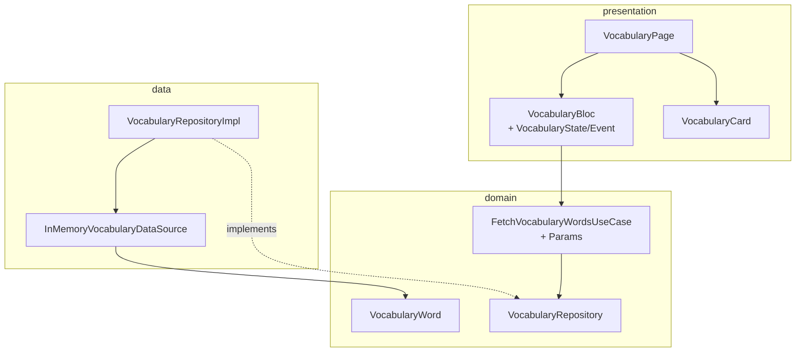

# 02 — Clean Architecture & các lớp

Mỗi feature trong `lib/features/<name>/` là **một lát Clean Architecture độc lập**. Hai feature tham chiếu chuẩn nhất là `vocabulary` và `lessons` — khi không chắc, hãy mở chúng ra so chiếu.

## Cấu trúc thư mục chuẩn

```
features/<name>/
├── data/
│   ├── datasources/         # InMemory… / Remote… (Dio) / Local… (sqlite)
│   └── repositories/        # implement repository interface ở domain
├── domain/
│   ├── entities/            # pure Dart, immutable, Equatable
│   ├── repositories/        # interface (abstract class)
│   └── usecases/            # 1 use case = 1 method của repository
└── presentation/
    ├── bloc/                # Bloc + state (+ event nếu là Bloc)
    ├── pages/               # Page widgets, gắn BlocProvider
    └── widgets/             # widget riêng của feature
```

> **Quan trọng:** *cả Bloc và Cubit đều nằm trong `presentation/bloc/`*. Không có thư mục `presentation/cubit/` riêng.

## `domain/` — lõi nghiệp vụ

Lớp này **không phụ thuộc Flutter**. Chỉ pure Dart, không import `package:flutter/...`.

### Entity

- Immutable, kế thừa `Equatable`.
- Không có annotation JSON (mapping JSON là việc của data layer).
- Có thể có hành vi thuần (getter, factory) nhưng không I/O.
- **Entity chứa learning content** (vocabulary, topic, lesson, quiz question) phải mang trường **tiếng Việt** (mẹ đẻ) song song với cặp target EN/JA — vì gloss/explanation luôn bằng tiếng Việt khi người Việt học EN hoặc JA. Xem [08 — i18n](./08-localization.md).

### Repository interface

- Một `abstract class` mô tả các thao tác dữ liệu mà domain cần.
- Trả về `Future<T>` hoặc `Stream<T>` thuần — **không** trả về `Either<Failure, T>`. Việc bọc `Either` là của use case.

```dart
// features/vocabulary/domain/repositories/vocabulary_repository.dart
abstract class VocabularyRepository {
  Future<List<VocabularyWord>> fetchWords({
    required LearningLanguage language,
    JlptLevel? jlptLevel,
  });
}
```

### Use case

- Mỗi public method của repository ↔ một use case.
- Extend `UseCase<T, P>` hoặc `StreamUseCase<T, P>` (`lib/core/usecases/usecase.dart`).
- Tham số gộp trong một class `…Params` riêng (Equatable) nếu nhiều hơn 1.
- Bắt exception và map sang `Failure` (xem [06 — Error handling](./06-error-handling.md)).
- Trả về `Future<Either<Failure, T>>` hoặc `Either<Failure, Stream<T>>`.

```dart
class FetchVocabularyWordsUseCase
    extends UseCase<List<VocabularyWord>, FetchVocabularyWordsParams> {
  FetchVocabularyWordsUseCase(this._repository);
  final VocabularyRepository _repository;

  @override
  Future<Either<Failure, List<VocabularyWord>>> call(
    FetchVocabularyWordsParams params,
  ) async {
    try {
      final words = await _repository.fetchWords(
        language: params.language,
        jlptLevel: params.jlptLevel,
      );
      return Right(words);
    } on ServerException catch (e) {
      return Left(ServerFailure(e.message));
    } catch (_) {
      return const Left(UnknownFailure());
    }
  }
}
```

## `data/` — chi tiết dữ liệu

### DataSource

- Lớp thực hiện thao tác I/O thật (HTTP, file, DB) hoặc giả lập (in-memory).
- Có thể ném `ServerException` / `NetworkException` từ `core/exceptions/app_exceptions.dart`.
- Đối với in-memory stub (hiện tại), dùng map/list cứng + `Future.delayed` để mô phỏng độ trễ mạng.

### Repository implementation

- Implement interface ở `domain/`.
- Hợp nhất nhiều data source nếu có (remote + local cache), thường mỏng — chỉ là layer chuyển đổi và lưu cache.
- Một số repository (như `ProgressRepository`) giữ `StreamController` để các Bloc/Cubit khác có thể `watch()` — xem [04 — DI](./04-dependency-injection.md) để biết vì sao phải là **singleton**.

## `presentation/` — UI + Bloc

### Bloc / Cubit

- Inject **use case** qua constructor (named cho ≥ 3 dep).
- `state` là **một class immutable duy nhất** với `copyWith` và một `enum status` (vd `initial / loading / loaded / error`).
- Side-effect (navigate/snackbar/dialog) **không** ở trong `build`/`mapEventToState` — dùng `BlocListener` ở UI.

### Page

- Bọc `BlocProvider(create: (_) => getIt<XBloc>())` ngay tại page.
- `BlocBuilder` / `BlocSelector` để render; `BlocListener` cho side-effect.
- Không bao giờ đọc/ghi `state` trực tiếp ngoài bloc.

### Widget

- "Câm" — nhận data qua constructor, callback ra ngoài bằng `VoidCallback`/`ValueChanged`.
- Tách widget riêng khi: dùng lại, vượt 200 dòng, hoặc có animation/gesture phức tạp.

## Ví dụ một feature đầy đủ — `vocabulary`



## Anti-pattern phải tránh

| ❌ Sai | ✅ Đúng |
|---|---|
| Bloc inject thẳng `XRepository` | Bloc inject `XUseCase` |
| Use case trả về `T` rồi để Bloc try/catch | Use case trả về `Either<Failure, T>`, Bloc `fold` |
| Page gọi `Navigator.push(MaterialPageRoute(...))` | `context.push(RouteNames.x, extra: Args(...))` |
| Đăng ký repository là `registerFactory` | `registerLazySingleton` (xem [04 — DI](./04-dependency-injection.md)) |
| Đọc state qua field public của Bloc | `BlocBuilder` / `BlocSelector` |
| Tạo thư mục `presentation/cubit/` riêng | Cubit nằm cùng `presentation/bloc/` |
