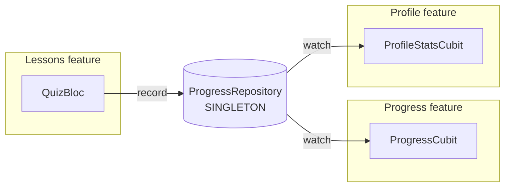
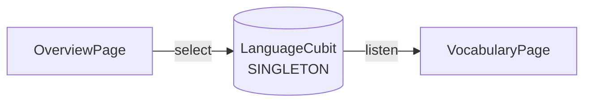
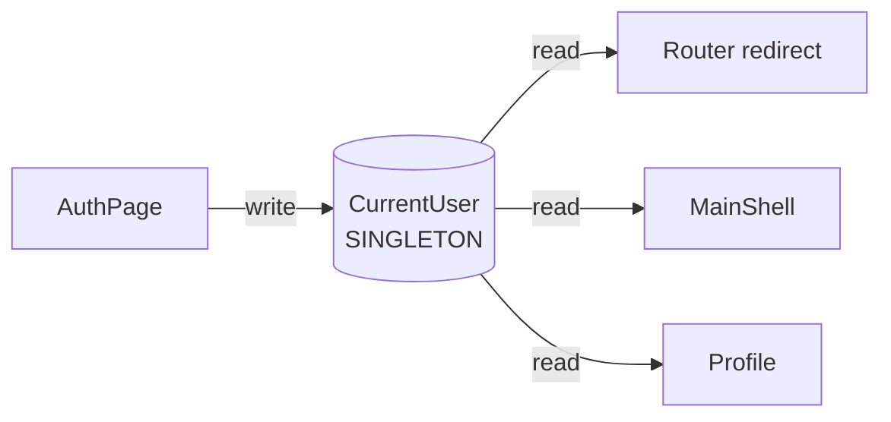

# 04 — Dependency Injection (GetIt)

DI **duy nhất** trong project là `get_it` thông qua `lib/config/di/service_locator.dart`. Mọi service cross-cutting đăng ký tại đây và resolve bằng `getIt<T>()`.

**Cấm**: `MultiRepositoryProvider`, `RepositoryProvider`, gọi `XRepository()` trực tiếp ở trong widget.

## Cấu trúc `service_locator.dart`

File được chia thành 7 nhóm theo lifetime/role:

```
setupServiceLocator()
├── 1. Session              ── lazySingleton: CurrentUser
├── 2. Network              ── lazySingleton: DioClient
├── 3. Data sources         ── lazySingleton: InMemory…DataSource
├── 4. Repositories         ── lazySingleton  (KHÔNG factory!)
├── 5. Use cases            ── factory       (rẻ, stateless)
├── 6. App-wide Blocs       ── lazySingleton: LocaleCubit / LanguageCubit
└── 7. Page-scoped Blocs    ── factory  (mỗi page một instance mới)
```

## Lifetime — chọn loại nào?

| API GetIt | Khi nào dùng | Ví dụ |
|---|---|---|
| `registerSingleton<T>(T)` | Đã có instance từ trước, cần ngay khi app start | Hiếm dùng |
| `registerLazySingleton<T>(() => T)` | Tạo một lần, share trong app, dùng từ lần resolve đầu | `DioClient`, `CurrentUser`, **mọi repository**, data source, app-wide cubit |
| `registerFactory<T>(() => T)` | Mới mỗi lần resolve, không có state cần share | Use case, page-scoped Bloc/Cubit |
| `registerFactoryParam<T, P1, P2>((p1, p2) => T)` | Bloc cần tham số khi tạo | `QuizBloc(lesson)` |

## ⚠️ Quy tắc bất khả phạm: Repository = lazySingleton

```dart
// ❌ SAI — sẽ làm vỡ flow progress
getIt.registerFactory<ProgressRepository>(() => InMemoryProgressRepository());

// ✅ ĐÚNG
getIt.registerLazySingleton<ProgressRepository>(() => InMemoryProgressRepository());
```

Vì sao:

- `ProgressRepository` giữ một `StreamController` mà `ProgressCubit` + `ProfileStatsCubit` đang `listen` qua `WatchProgressUseCase`. Nếu là factory → mỗi nơi nhận một instance khác → ghi từ `QuizBloc` không bao giờ tới được hai listener kia.
- Tất cả repository in-memory hiện tại đều giữ state trong RAM. Đăng ký factory = mất state mỗi lần dùng.

**Coi quy tắc này là load-bearing. Đừng đổi.**

## App-wide blocs cần load on startup

```dart
getIt.registerLazySingleton<LocaleCubit>(
  () => LocaleCubit(loadLocale: getIt(), saveLocale: getIt())..load(),
);
```

`..load()` được gọi ngay khi lazy singleton được khởi tạo, đảm bảo ngôn ngữ hiển thị được phục hồi trước khi `MaterialApp.router` render lần đầu (vì `AppBlocProviders` resolve nó để bọc app).

## App-wide Bloc được provide thế nào

```dart
// lib/config/provider/bloc_providers.dart
abstract final class AppBlocProviders {
  static List<BlocProvider> get providers => [
    BlocProvider<LocaleCubit>.value(value: getIt<LocaleCubit>()),
    BlocProvider<LanguageCubit>.value(value: getIt<LanguageCubit>()),
  ];
}
```

Dùng `BlocProvider.value` (không `BlocProvider(create:)`) — vì đây là singleton, không tạo mới. Bọc quanh `MaterialApp.router` trong `StudyLingoApp`.

## Page-scoped: provide ngay trong page

```dart
class VocabularyPage extends StatelessWidget {
  @override
  Widget build(BuildContext context) {
    return BlocProvider(
      create: (_) => getIt<VocabularyBloc>()..add(const VocabularyRequested(...)),
      child: const _VocabularyView(),
    );
  }
}
```

Tránh provide bloc page-scope ở app root — sẽ giữ instance đó suốt vòng đời app dù page đã pop.

## Bloc có tham số — `registerFactoryParam`

`QuizBloc` cần biết quiz đang chạy thuộc `Lesson` nào:

```dart
// service_locator.dart
getIt.registerFactoryParam<QuizBloc, Lesson, void>(
  (lesson, _) => QuizBloc(
    lesson: lesson,
    recordLessonCompleted: getIt(),
  ),
);

// QuizPage
BlocProvider(
  create: (_) => getIt<QuizBloc>(param1: args.lesson)..add(const QuizStarted()),
  child: const _QuizView(),
);
```

GetIt giới hạn 2 tham số (`param1`, `param2`). Nếu cần nhiều hơn, gói vào một `Params` class.

## Cross-feature wiring qua singleton

Ba "trục" singleton ràng buộc các feature mà không tạo bloc-to-bloc coupling:







Khi thêm feature mới cần phản ứng với feature khác — **luôn** chia sẻ qua singleton repository như vậy, đừng inject bloc này vào bloc kia.

## Reset trong test

`test/helpers/test_di.dart` cung cấp `useTestServiceLocator()` để setup + tear down giữa các test. Xem [09 — Testing](./09-testing.md).
