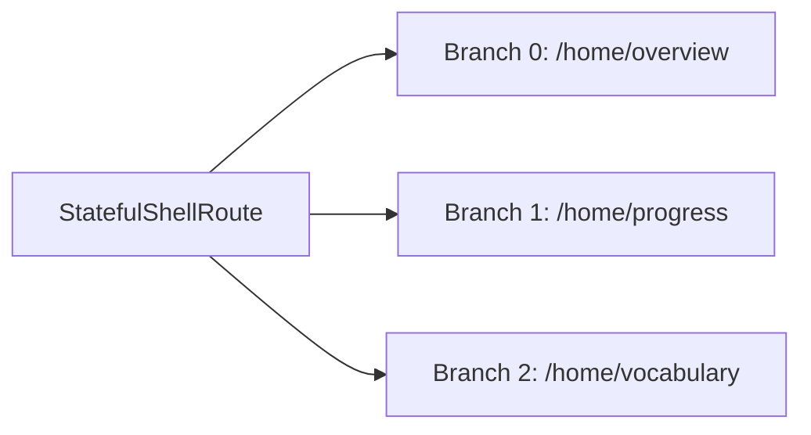

# 05 — Routing (GoRouter)

Navigation 100% qua **`go_router`** với 2 file là nguồn sự thật:

- `lib/config/router/route_names.dart` — *các path string constant*.
- `lib/config/router/app_router.dart` — *router thật*, gồm auth gate (`redirect`), `StatefulShellRoute`, và typed `extra` args.

**Cấm**: `Navigator.push(MaterialPageRoute(...))` cho navigation trang-tới-trang. (Modal sheet như More menu tự có Navigator riêng — vẫn dùng `Navigator.pop(entry)` để trả kết quả về.)

## Auth gate qua `redirect`

```dart
GoRouter(
  initialLocation: RouteNames.auth,
  redirect: (context, state) {
    final user = getIt<CurrentUser>().value;
    final loggingIn = state.matchedLocation.startsWith(RouteNames.auth);
    if (user == null && !loggingIn) return RouteNames.auth;
    if (user != null && loggingIn)  return RouteNames.overview;
    return null;
  },
  routes: [...],
);
```

Hệ quả:

- Chưa đăng nhập + truy cập `/home/*` → đẩy về `/auth`.
- Đã đăng nhập + cố vào `/auth` → đẩy thẳng vào `/home/overview`.
- Để "đăng xuất + xoá stack", chỉ cần `CurrentUser.value = null; context.go(RouteNames.auth)` — redirect lo phần còn lại.

## Bottom navigation = `StatefulShellRoute.indexedStack`



Mỗi branch giữ navigation stack + scroll position riêng khi đổi tab. `MainShell` nhận `StatefulNavigationShell` và render `IndexedStack`.

### Đích "•••" (More) là action, không phải tab

```dart
onDestinationSelected: (i) {
  if (i >= _branchCount) {
    showMoreMenu(context, user);     // modal bottom sheet
  } else {
    shell.goBranch(i);
  }
}
```

Quan trọng: vì More không phải tab, **selectedIndex giữ nguyên** sau khi đóng sheet. Đừng đẩy nó vào shell branch — UX sẽ vỡ.

## Typed `extra` — không string-passing

Tất cả route có argument đều có class `…Args` đi kèm trong `app_router.dart`:

```dart
class TopicsPageArgs {
  const TopicsPageArgs({required this.language, required this.skill});
  final LearningLanguage language;
  final LearningSkill skill;
}

GoRoute(
  path: RouteNames.topics,
  builder: (context, state) {
    final args = state.extra! as TopicsPageArgs;
    return TopicsPage(language: args.language, skill: args.skill);
  },
);

// callsite
context.push(
  RouteNames.topics,
  extra: TopicsPageArgs(language: LearningLanguage.japanese, skill: LearningSkill.writing),
);
```

Các `…Args` hiện có: `TopicsPageArgs`, `LessonsPageArgs`, `QuizPageArgs`, `CharacterTracingArgs`, `SettingsPlaceholderArgs`. Khi route mới có argument, **luôn** định nghĩa Args class — không truyền raw `Map` hay positional.

## Bản đồ route

| Route | Mục đích | Extra |
|---|---|---|
| `/auth` | Login / Register / OAuth | — |
| `/auth/forgot` | Quên mật khẩu (3 bước) | — |
| `/home/overview` | Tab 1: dashboard học | — |
| `/home/progress` | Tab 2: streak + 7-day | — |
| `/home/vocabulary` | Tab 3: deck từ vựng | — |
| `/topics` | Danh sách topics theo skill | `TopicsPageArgs` |
| `/lessons` | Danh sách lesson trong topic | `LessonsPageArgs` |
| `/quiz` | Quiz một lesson | `QuizPageArgs` |
| `/practice` | Bài luyện tổng hợp | — |
| `/profile` | Hồ sơ | `AuthUser` |
| `/settings` | Hub settings | — |
| `/settings/language` | Chọn ngôn ngữ hiển thị | — |
| `/settings/placeholder` | Trang giữ chỗ (Privacy/Terms/...) | `SettingsPlaceholderArgs` |
| `/reminders` | Nhắc học | — |
| `/writing` | Hub luyện viết (Hira/Kata/Kanji) | — |
| `/writing/tracing` | Tracing canvas | `CharacterTracingArgs` |
| `/kanji` | Danh sách kanji | — |
| `/kanji/detail` | Chi tiết kanji | `Kanji` |

## Chuyển trang trong code

| Mục đích | Cách dùng |
|---|---|
| Vào trang con (push lên stack) | `context.push(RouteNames.x, extra: Args(...))` |
| Thay thế stack (đăng nhập/đăng xuất) | `context.go(RouteNames.x)` |
| Quay lại | `context.pop()` (hoặc `Navigator.pop(value)` cho modal) |

## Trong test

**Không** dùng `appRouter` thật trong widget test — có auth redirect sẽ gây phiền. Dùng `buildTestRouter(home: pageUnderTest, extraRoutes: [...])` từ `test/helpers/test_router.dart`. Xem [09 — Testing](./09-testing.md).
