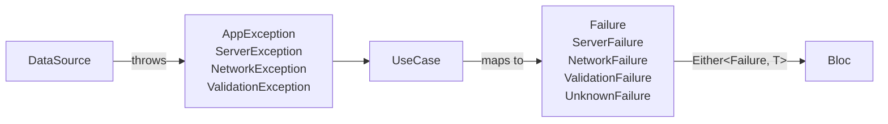

# 06 — Error handling (Either / Failure)

Project dùng **functional error handling** với `dartz`. Quy tắc một câu: *use case bắt exception, trả `Either<Failure, T>`; bloc `fold` để emit success/failure*.

## Hai trục: Exception (data) vs Failure (domain)



| Lớp | Loại | File |
|---|---|---|
| `data/datasources/` | `throw ServerException(...)` etc. | `core/exceptions/app_exceptions.dart` |
| `domain/usecases/` | `return Left(ServerFailure(...))` | `core/utils/failure.dart` |
| `presentation/bloc/` | `result.fold(...)` | — |

Lý do tách: domain layer **không biết** HTTP/sqlite có tồn tại. Nó chỉ biết "có cái sai xảy ra" qua `Failure`. Đổi backend = đổi exception nhưng `Failure` giữ nguyên.

## Khung use case chuẩn

```dart
class FetchTopicsUseCase extends UseCase<List<Topic>, FetchTopicsParams> {
  FetchTopicsUseCase(this._repo);
  final LessonsRepository _repo;

  @override
  Future<Either<Failure, List<Topic>>> call(FetchTopicsParams p) async {
    try {
      final topics = await _repo.fetchTopics(language: p.language, skill: p.skill);
      return Right(topics);
    } on ServerException catch (e) {
      return Left(ServerFailure(e.message));
    } on NetworkException catch (e) {
      return Left(NetworkFailure(e.message));
    } catch (_) {
      return const Left(UnknownFailure());
    }
  }
}
```

Ánh xạ điển hình:

| Exception | → Failure |
|---|---|
| `ServerException` | `ServerFailure` |
| `NetworkException` | `NetworkFailure` |
| `ValidationException` | `ValidationFailure` |
| `AuthException` | `ValidationFailure` (đăng nhập sai = lỗi nghiệp vụ) |
| *anything else* | `UnknownFailure` |

## Stream — dùng `StreamUseCase`

Khi dữ liệu là `Stream` (ví dụ `ProgressRepository.watch()`), use case trả về `Either<Failure, Stream<T>>` (không phải `Stream<Either<Failure, T>>`):

```dart
class WatchProgressUseCase extends StreamUseCase<DailyProgress, NoParams> {
  WatchProgressUseCase(this._repo);
  final ProgressRepository _repo;

  @override
  Either<Failure, Stream<DailyProgress>> call(NoParams _) {
    try {
      return Right(_repo.watch());
    } catch (_) {
      return const Left(UnknownFailure());
    }
  }
}
```

## Fold ở Bloc

```dart
final result = await fetchTopics(FetchTopicsParams(language: lang, skill: skill));
result.fold(
  (failure) => emit(state.copyWith(
    status: TopicsStatus.error,
    errorMessage: failure.message,
  )),
  (topics) => emit(state.copyWith(
    status: TopicsStatus.loaded,
    topics: topics,
  )),
);
```

Một số lưu ý:

- **Không** dùng `result.isRight()`/`getOrElse()` rồi nhánh thủ công — luôn `fold` để đảm bảo exhaustive.
- **Không** `try/catch` quanh `await fetchTopics(...)` — use case đã làm việc đó.
- Nếu cần chain nhiều use case, dùng `.flatMap` của `dartz` hoặc đơn giản là `fold` rồi gọi tiếp.

## Hiển thị lỗi ở UI

UI chỉ đọc `state.errorMessage` qua `BlocBuilder`/`BlocSelector`, và side-effect (SnackBar) qua `BlocListener`:

```dart
BlocListener<XBloc, XState>(
  listenWhen: (prev, curr) => prev.status != XStatus.error && curr.status == XStatus.error,
  listener: (context, state) {
    ScaffoldMessenger.of(context).showSnackBar(
      SnackBar(content: Text(state.errorMessage ?? 'Có lỗi')),
    );
  },
  child: ...,
);
```

Widget chung `shared/widgets/error_retry_view.dart` (xem `lib/shared/widgets/`) dùng để hiển thị "có lỗi + nút thử lại" trong nhánh `status == error`.

## Anti-pattern phải tránh

| ❌ Sai | ✅ Đúng |
|---|---|
| Use case trả `Future<T>` rồi để Bloc `try/catch` | `Future<Either<Failure, T>>` |
| Repository trả `Either` | Repository trả `Future<T>` thuần; use case bọc `Either` |
| Bloc bắt exception cụ thể (`on DioException`) | Bloc fold trên `Failure`; DataSource bắt Dio và rethrow `ServerException` |
| Map bằng `result.isLeft()` + `getOrElse()` | `result.fold(onLeft, onRight)` |
