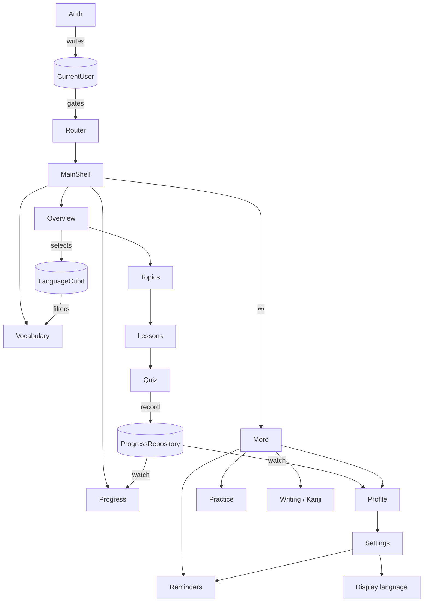

# 07 — Bản đồ feature

Một-bảng-một-cái-nhìn cho từng feature trong `lib/features/`.

## Tổng quan kết nối

## Bảng feature

| Feature | Vai trò | Bloc/Cubit chính | Phụ thuộc singleton |
|---|---|---|---|
| **auth** | Login/Register/OAuth + Forgot password (3 bước) | `AuthBloc`, `ForgotPasswordBloc` | ghi `CurrentUser` |
| **lessons** | Overview → topics → lessons → quiz, practice | `TopicsCubit`, `LessonsCubit`, `QuizBloc`, `LanguageCubit` | đọc `LanguageCubit`, ghi `ProgressRepository` |
| **vocabulary** | Deck từ vựng theo ngôn ngữ + JLPT | `VocabularyBloc` | đọc `LanguageCubit` |
| **writing** | Tracing Hiragana/Katakana/Kanji + thứ tự nét | `WritingPracticeCubit` | — |
| **kanji** | Danh sách + chi tiết kanji (JLPT N5) | `KanjiListCubit` | — |
| **progress** | Streak hằng ngày + cửa sổ 7 ngày | `ProgressCubit` | đọc `ProgressRepository.watch()` |
| **profile** | Hồ sơ + lifetime stats | `ProfileStatsCubit` | đọc `CurrentUser`, `ProgressRepository.watch()` |
| **reminders** | Cấu hình nhắc học | `RemindersCubit` | — |
| **settings** | Hub: Giao diện & ngôn ngữ / Thông báo / Khác | `LocaleCubit` (app-wide) | đọc/ghi `LocaleCubit` |
| **more** | Modal sheet "•••" | (không có bloc) | — |

## Auth

- **Entry point** của app. Khi `CurrentUser == null`, router luôn đẩy về `/auth`.
- `AuthBloc` gom 5 use case theo named param: `signInWithEmail` / `signUpWithEmail` / `signInWithGoogle` / `signInWithFacebook` / `signOut`. Google/Facebook chỉ là event khác cùng đi qua `_run` helper.
- State chứa toàn bộ form (`email`, `password`, `confirmPassword`, `mode`, `status`) + derived getter (`isEmailValid`, `canSubmit`,…). UI không validate riêng.
- `ForgotPasswordBloc` chạy 3 bước (request → verify → reset) bằng `RequestOtpUseCase` / `VerifyOtpUseCase` / `ResetPasswordUseCase`.
- **Stub hôm nay** = `FakeAuthRepository` + `FakePasswordResetRepository`. Trigger lỗi sẵn: email `taken@example.com` (sign-up), password `wrong` (sign-in).
- **Đi live**: implement `AuthRepository` thật (firebase_auth + google_sign_in + flutter_facebook_auth) → đổi đăng ký trong `service_locator.dart`. Không UC/Bloc/UI nào phải sửa.

## Lessons (+ quiz, practice, language selection)

Flow Lessons-tab: **Overview dashboard → chọn skill → topics → lessons → quiz**.

- `OverviewPage` (`features/lessons/.../pages/overview_page.dart`) là tab "Tổng quan" — promo banner, language chip row, skill grid (5 skill: Ngữ pháp / Từ vựng / Nghe nói / Đọc / Viết).
- Chip ngôn ngữ → `LanguageCubit.select(...)` → vocabulary deck cũng tự đổi.
- Skill card → `context.push(RouteNames.topics, extra: TopicsPageArgs(language, skill))`.
- Topic → `LessonsPage` (`extra: LessonsPageArgs(topic, language)`).
- Lesson → `QuizPage` (`extra: QuizPageArgs(lesson, lessonTitle)`).
- **Render mẹ đẻ**: `Topic.titleIn(language)` / `Lesson.titleIn(language)` chọn dòng chính là **target language**; dòng phụ là **tiếng Việt** (gloss). Prompt + explanation của `QuizQuestion` đi ra bằng tiếng Việt từ data layer; lựa chọn đáp án giữ ở target language. (Code hiện tại chưa có trường tiếng Việt — xem mục Vocabulary bên dưới.)
- `QuizBloc` được seed `Lesson` qua `getIt<QuizBloc>(param1: lesson)`. Khi xong: gọi `RecordLessonCompletedUseCase` (XP = `correctCount × lesson.xpPerCorrectAnswer`) — *Progress tab và Profile tự cập nhật qua singleton repository*.
- Seed data quiz: `seedTopics` + `_japaneseTargetLessons` / `_englishTargetLessons` (trong `data/datasources/`).

### Practice mode (More → Luyện tập)

`PracticePage` → user chọn language → `getIt<LessonsRepository>().fetchPracticeLesson(language)` ghép một `Lesson` "practice" (mix breadth-first các topic, cap 8 câu) → đi qua **đúng `QuizBloc`/`QuizPage`**. → finishing practice cũng record daily progress.

## Vocabulary

- `VocabularyWord` mang `target: LearningLanguage` (enum chia sẻ từ lessons/domain) — đánh dấu thuộc deck nào.
- JLPT / furigana / romaji chỉ áp dụng cho deck Nhật.
- `FetchVocabularyWordsUseCase(language, jlptLevel)` lọc cả hai.
- **Theo dõi phiên học**: load đầu = `context.read<LanguageCubit>().state`; `BlocListener<LanguageCubit, …>` re-request khi đổi.
- UI: session active → chip "Đang học: …"; phiên English → ẩn chip JLPT.
- `VocabularyCard` render target làm primary line (JA: furigana over kanji; EN: headline), **gloss bằng tiếng Việt (mẹ đẻ)**, example bằng target language trước rồi tới câu dịch tiếng Việt.
- Strings UI chrome đã migrate sang ARB (chrome ≠ content — xem [08 — i18n](./08-localization.md)).

> **Gap hiện tại**: entity `VocabularyWord` mới có cặp `english`/`japanese` + furigana/romaji, **chưa có trường tiếng Việt**. Tương tự `Topic`/`Lesson` mới có `titleEn`/`titleJa` và `subtitleIn(language)` trả về *ngôn ngữ kia trong cặp* — chưa khớp quy tắc mẹ đẻ. Khi sửa content schema, thêm `vietnamese` / `titleVi` / `exampleVi` và đổi `subtitleIn` thành getter `gloss` (tiếng Việt).

## Writing (Japanese only)

- Trong **Viết** skill (JA), `TopicsPage` prepend 2 card đặc biệt: **"Luyện viết chữ"** → `/writing`, và **"Học Hán tự"** → `/kanji`.
- `WritingHomePage` cho chọn Hiragana / Katakana / Kanji (`InMemoryWritingRepository` có đủ gojūon).
- Tracing: faint guide trên `TracingCanvas` (`CustomPaint` + `GestureDetector` bắt finger). `WritingPracticeCubit` giữ list + index. **Nét vẽ là `StatefulWidget` cục bộ** (high-frequency pointer không nên đẩy vào Cubit) — `BlocConsumer.listener` xoá khi đổi index.
- Stroke order: `stroke_order_data.dart` chứa subset polyline chuẩn-hoá 0..1 cho số/kanji đơn giản + một số kana. `strokeOrderFor(glyph)` != null → hiện nút "Thứ tự nét" → `StrokeOrderView` animate có số.
- Tracing route cũng nhận `characters: [...]` thay vì `script` — dùng khi trace kanji đơn lẻ từ trang detail.

## Kanji (Japanese only)

- `KanjiListPage` grid (`KanjiListCubit` + `FetchKanjiListUseCase` qua `InMemoryKanjiRepository`, ~12 N5 kanji).
- `KanjiDetailPage` (meaning, on/kun yomi, example word) + nút "Luyện viết chữ này" → `RouteNames.characterTracing` với `CharacterTracingArgs(characters: [kanji])`.

## Progress

- `DailyProgress` (date + XP + lessons completed).
- `ProgressRepository.watch()` exposes stream — *singleton* để mọi nơi subscribe cùng instance.
- `ProgressCubit` derive streak + 7-day window từ stream.

## Profile

- Đọc `AuthUser` từ `CurrentUser`.
- `ProfileStatsCubit` subscribe cùng `WatchProgressUseCase` (lifetime stats + streak).
- App-bar gear → `RouteNames.settings`.

## Reminders

- `ReminderSettings` (enabled, time, weekdays).
- Mọi mutation đi qua `SaveReminderSettingsUseCase` — *vừa persist (`ReminderRepository.save`) vừa re-sync OS notifications (`ReminderScheduler.sync`)*.
- Stub: `InMemoryReminderRepository` + `LoggingReminderScheduler`.
- **Đi live**: shared_preferences cho repo; `flutter_local_notifications` + `timezone` cho scheduler (weekly `zonedSchedule` per weekday). Android: channel + POST_NOTIFICATIONS. iOS: permission. Đổi 2 đăng ký trong `service_locator.dart`.

## Settings & display language

- Hub list: Giao diện & ngôn ngữ / Thông báo / Khác.
- "Thông báo" → Reminders.
- "Ngôn ngữ hiển thị" → `LanguageSettingsPage` → `LocaleCubit` (singleton, `Cubit<AppLanguage>`, default Vietnamese).
- Persist qua `LoadLocaleUseCase` / `SaveLocaleUseCase` → `LocaleRepository` (stub `InMemoryLocaleRepository`; backup bằng shared_preferences khi cần).
- `AppLanguage` ≠ `LearningLanguage` — đây là **ngôn ngữ hiển thị** của app, kia là **ngôn ngữ đang học**.
- Xem chi tiết tại [08 — i18n](./08-localization.md).

## More (modal sheet, không phải tab)

- Khi user tap đích thứ 4 trên bottom nav, `MainShell` mở `showMoreMenu(context, user)` — modal bottom sheet với entries (Hồ sơ, Luyện tập, …).
- Mỗi `ListTile` `Navigator.pop(entry)` để trả entry; `MainShell` dispatch theo entry.
- Vì sheet có Navigator riêng tách khỏi GoRouter, `Navigator.pop` ở đây **không vi phạm** rule "không dùng Navigator.push".
