# Database schema

Sơ đồ ER suy ra từ các entity ở `lib/features/*/domain/entities/` và `lib/core/constants/`. Hiện tại tất cả repository đều dùng stub in-memory; sơ đồ này mô tả lược đồ đề xuất khi chuyển sang database thật (SQL hoặc Firestore-style — mapping trực tiếp).

## Tổng quan các nhóm bảng

- **Identity & session**: `users`, `password_reset_otps`
- **Per-user settings**: `user_settings`, `reminder_settings`, `reminder_weekdays`
- **User progress**: `daily_progress`
- **Catalog — Japanese**: `japanese_topics`, `japanese_lessons`, `japanese_vocabulary_words`, `kanji`, `writing_characters`
- **Catalog — English**: `english_topics`, `english_lessons`, `english_vocabulary_words`
- **Catalog — Study (cross-language)**: `study_topics`, `study_lessons`
- **Quiz (polymorphic)**: `quiz_questions`, `quiz_question_options`

Mỗi `*_lessons` table sở hữu một bộ `quiz_questions` của riêng nó (phân biệt qua `lesson_type` + `lesson_id`). Đây là cách giữ một schema câu hỏi duy nhất mà vẫn phục vụ được ba nguồn lesson độc lập (English, Japanese, Study).

## ER diagram

```mermaid
erDiagram
    USERS {
        string id PK
        string email "UNIQUE, nullable for social"
        string password_hash "nullable, email provider only"
        string display_name "nullable"
        string photo_url "nullable"
        enum   provider "email|google|facebook"
        enum   gender "male|female|other, nullable"
        datetime created_at
        datetime updated_at
    }

    PASSWORD_RESET_OTPS {
        string id PK
        string user_id FK
        enum   channel "email|phone"
        string code_hash
        datetime expires_at
        datetime consumed_at "nullable"
    }

    USER_SETTINGS {
        string user_id PK,FK
        enum   app_language "vi|en|ja"
        enum   theme_mode "light|dark"
        enum   learning_language "en|ja, nullable"
        datetime updated_at
    }

    REMINDER_SETTINGS {
        string user_id PK,FK
        bool   enabled
        int    hour "0-23"
        int    minute "0-59"
        datetime updated_at
    }

    REMINDER_WEEKDAYS {
        string user_id PK,FK
        int    weekday PK "1-7 (DateTime.monday..sunday)"
    }

    DAILY_PROGRESS {
        string id PK
        string user_id FK
        date   date "UNIQUE(user_id, date)"
        int    lessons_completed
        int    xp_earned
    }

    JAPANESE_TOPICS {
        string id PK
        enum   skill "grammar|vocabulary|listeningSpeaking|reading|writing"
        string title
        string emoji
        int    lesson_count
    }

    JAPANESE_LESSONS {
        string id PK
        string topic_id FK
        string title
        int    position
    }

    JAPANESE_VOCABULARY_WORDS {
        string id PK
        string japanese
        string vietnamese
        string furigana "nullable"
        string romaji "nullable"
        int    jlpt_level "1-5, nullable"
        string example_japanese "nullable"
        string example_vietnamese "nullable"
    }

    KANJI {
        string glyph PK
        string meaning
        string onyomi
        string kunyomi
        string example_word
        string example_reading
        string example_meaning
    }

    WRITING_CHARACTERS {
        string id PK
        string glyph
        string reading "romaji"
        string meaning "nullable, kanji only"
        enum   script "hiragana|katakana|kanji"
        int    position
    }

    ENGLISH_TOPICS {
        string id PK
        enum   skill "grammar|vocabulary|listeningSpeaking|reading|writing"
        string title
        string emoji
        int    lesson_count
    }

    ENGLISH_LESSONS {
        string id PK
        string topic_id FK
        string title
        int    position
    }

    ENGLISH_VOCABULARY_WORDS {
        string id PK
        string english
        string vietnamese
        string example_english "nullable"
        string example_vietnamese "nullable"
    }

    STUDY_TOPICS {
        string id PK
        enum   language "en|ja"
        string title
        string subtitle
        string emoji
        int    lesson_count
    }

    STUDY_LESSONS {
        string id PK
        string topic_id FK
        string title
        enum   focus "grammar|pronunciation|vocabulary"
        int    position
    }

    QUIZ_QUESTIONS {
        string id PK
        enum   lesson_type "english|japanese|study"
        string lesson_id "FK polymorphic"
        string prompt
        int    correct_index
        string explanation "nullable"
        int    position
    }

    QUIZ_QUESTION_OPTIONS {
        string id PK
        string question_id FK
        int    position
        string text
    }

    USERS ||--o| USER_SETTINGS         : "has"
    USERS ||--o| REMINDER_SETTINGS     : "has"
    USERS ||--o{ REMINDER_WEEKDAYS     : "selects"
    USERS ||--o{ DAILY_PROGRESS        : "accumulates"
    USERS ||--o{ PASSWORD_RESET_OTPS   : "requests"

    JAPANESE_TOPICS  ||--o{ JAPANESE_LESSONS : "groups"
    ENGLISH_TOPICS   ||--o{ ENGLISH_LESSONS  : "groups"
    STUDY_TOPICS     ||--o{ STUDY_LESSONS    : "groups"

    JAPANESE_LESSONS ||--o{ QUIZ_QUESTIONS : "lesson_type=japanese"
    ENGLISH_LESSONS  ||--o{ QUIZ_QUESTIONS : "lesson_type=english"
    STUDY_LESSONS    ||--o{ QUIZ_QUESTIONS : "lesson_type=study"

    QUIZ_QUESTIONS ||--o{ QUIZ_QUESTION_OPTIONS : "has 2..4"
```

## Ghi chú thiết kế

- **Polymorphic quiz**: `quiz_questions.lesson_id` không có FK cứng trong DB; ràng buộc toàn vẹn được áp dụng ở tầng ứng dụng (use case), tương ứng với `lesson_type`. Nếu muốn FK cứng, tách thành ba bảng `*_quiz_questions`.
- **`quiz_question_options`** tách ra khỏi `quiz_questions` để cho phép số đáp án linh hoạt (entity hiện tại lưu `List<String> options`). Nếu cố định 4 đáp án có thể nhúng thành 4 cột phẳng `option_a..option_d`.
- **`reminder_weekdays`**: dùng bảng phụ thay vì cột bitmask để query/index theo weekday dễ hơn. Tuân theo quy ước Dart (`DateTime.monday = 1 … DateTime.sunday = 7`) — đúng với entity `ReminderSettings.weekdays`.
- **`daily_progress`**: `UNIQUE(user_id, date)` để `RecordLessonCompletedUseCase` chỉ upsert một dòng/ngày; streak được tính phía app từ chuỗi dates liên tiếp.
- **`learning_language` trong `user_settings`**: nullable vì `LanguageCubit` cho phép trạng thái "chưa chọn ngôn ngữ học" (hiện overview hint "choose a language").
- **`kanji`** dùng `glyph` làm PK (chữ Hán duy nhất); `writing_characters` cần `id` riêng vì cùng một glyph có thể xuất hiện ở nhiều script (hiếm) và để giữ thứ tự `position` cho bộ tracing.
- **Catalog vs progress**: tất cả bảng `*_topics`, `*_lessons`, `*_vocabulary_words`, `kanji`, `writing_characters`, `quiz_*` là **catalog read-mostly** (seed từ data layer). Chỉ `users`, `*_settings`, `daily_progress`, `password_reset_otps` là user-write. Có thể tách thành 2 datastore khác nhau khi đi production (ví dụ: catalog ở Firestore/CDN-cached JSON, user state ở Postgres/Firestore-user).
- **Chưa có** trong sơ đồ vì code hiện chưa cần: bảng favorites/SRS cho vocabulary, bảng quiz attempt history (mỗi câu trả lời), bảng audio assets. Thêm khi feature yêu cầu.
